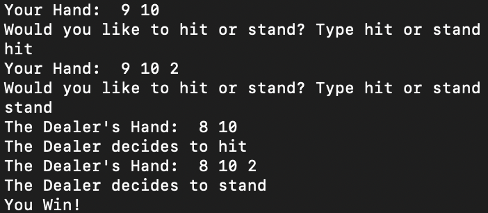
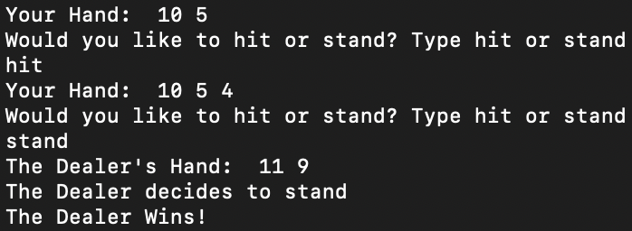
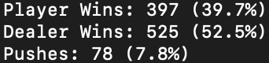

# Blackjack
#### Blackjack Game implementation in the terminal.
&nbsp;

To play the computer, run in terminal:

```
git clone https://github.com/JunnanShimizu/Blackjack.git
```
```
cd Blackjack
```
```
javac Play.java
```
```
java Play.java
```

Play examples:




&nbsp;

To run a simulation of 1000 Blackjack games for statistical purposes, in the same directory as above (Blackjack), run in terminal:
```
javac Simulation.java
```
```
java Simulation.java
```

Simulation example:



